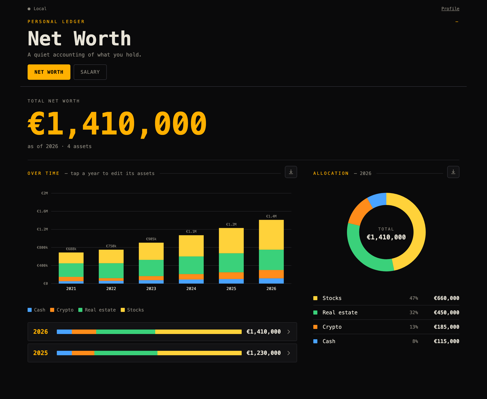

<p align="center">
  
</p>

<h1 align="center">nestegg.money</h1>

<p align="center">
  A private, zero-knowledge net worth &amp; salary tracker.<br>
  Encrypted in your browser. No email, no password, just an account number.
</p>

<p align="center">
  <a href="https://nestegg.money"><b>Live app</b></a>
</p>

<p align="center">
  <a href="https://github.com/VladimirWrites/nestegg.money/actions/workflows/ci.yml"></a>
  <a href="LICENSE"></a>
</p>

## Screenshots

<p align="center">
  
</p>

## Overview

A deliberately simple, zero-knowledge personal ledger. Single Cloudflare Worker
serving a static frontend (no framework, no bundler) plus three small API
routes, with D1 for storage. Login is a Mullvad-style account number; data is
encrypted in your browser before it's sent, so the server only ever stores
ciphertext.

## What it does

- **Over time**: a stacked bar chart of net worth per year, one colour per
  asset (or category), with a net-worth line when liabilities exist.
- **Allocation**: a donut of your most recent year.
- **Entry**: tap a year to open its editor; each row is one asset (name,
  currency, value). Add/remove assets, copy the previous year, rename the year.
- **Categories**: assets can be tagged into a category (e.g. several holdings
  under "Stocks"). The editor shows each category as a section with a
  subtotal; charts roll a category up into one segment.
- **Long-term assets & loans**: a car or house can depreciate/appreciate
  continuously and carry a loan with a real amortization schedule — extra
  payments, rate-fixed periods, payment-or-term entry. Its net value is
  injected into every year you own it.
- **Multi-currency**: each row carries its own currency; everything is shown
  in your chosen display currency at ECB rates (`/api/fx`). Past years use
  that year's year-end rates.
- **Ticker/crypto rows**: shares × live price via `/api/price` (Yahoo proxy).
  Past years freeze to that year's closing price. Only the public symbol is
  sent upstream — never an account or user identifier.
- **Salary**: monthly pay per person (gross or net — your choice), with events (raises, job changes),
  a dual-axis chart, and paste-from-spreadsheet import.
- **Budget**: a rough monthly "what's left" — income from your latest salary
  month, loan payments pulled from your assets, recurring expenses you enter,
  grouped into categories with a breakdown donut.
- **Forecast & retirement**: project net worth forward (contributions,
  growth, scenario band, FIRE goal) and simulate drawdown with a state
  pension (flat amount or German Rentenpunkte).
- **Sync**: zero-knowledge. The account number derives an account hash (the
  only thing the server sees) and an AES-GCM key (never leaves the browser).
  Multi-device edits merge per record with tombstones, newest wins.
  **No recovery** — keep the number safe; Export JSON is the real backup.
- **Share links**: publish a frozen, read-only snapshot of chosen sections for
  an advisor. Each share gets its own AES-GCM key, carried only in the URL
  fragment; the server stores an unlinkable id + ciphertext. Expires in 30
  days, revocable any time.
- **Bilingual**: English and German throughout — the app (language picker in
  the profile), the landing pages (`/` and `/de/`), and a public
  [Brutto-Netto-Rechner](https://nestegg.money/brutto-netto-rechner)
  ([English version](https://nestegg.money/en/german-net-salary-calculator))
  that runs the exact salary engine entirely in the browser.

## Layout

```
nestegg.money/
├── src/                  # the Worker: /api/fx, /api/price, /api/vault, /api/share,
│                         # /api/calc/*, /mcp, /.well-known/mcp.json + page routing
├── public/
│   ├── index.html        # marketing landing (generated; German at de/, see scripts/)
│   ├── dashboard.html    # the app — loads one <script type="module" src="js/main.js">
│   ├── brutto-netto-rechner.html  # public net-salary calculator (client-side, per-locale)
│   ├── i18n/             # runtime dictionaries (en, de)
│   ├── lib/              # finance-math: pure calculators incl. finance-math/de/
│   │                     #   (generated BMF PAP Lohnsteuer engines + statutory tables)
│   ├── css/              # base, landing, app styles
│   └── js/               # native ES modules (no bundler); layers point ui → io → domain
│       ├── domain/       #   pure logic, no DOM/network: money, dates, schema, ids,
│       │                 #   loan, asset-value, model, forecast, retirement, merge, store
│       ├── io/           #   effects: crypto (encrypt), storage (localStorage/sync/fetch)
│       ├── ui/           #   DOM: dom, chart-kit, charts, networth, assets, salary, gate
│       └── main.js       #   entry point: cross-cutting wiring + boot
├── scripts/              # generators: per-locale pages, BMF PAP → JS, calculator docs
├── tests/                # node --test: domain math, calculators, MCP, i18n page sync
├── schema.sql            # D1: one row per account (hash → encrypted blob)
└── wrangler.toml
```

The Worker runs first (`run_worker_first`) so it can route the landing page vs
the app by hostname and handle `/api/*`; everything else falls through to the
static assets binding. The frontend is a plain ES-module graph — the browser
loads it directly, no build step.

## Deploy

Requires a Cloudflare account and `npm i -g wrangler` (then `wrangler login`).

1. `wrangler d1 create networth-db` → copy the `database_id` into `wrangler.toml`.
2. `wrangler d1 execute networth-db --remote --file=schema.sql`
3. `wrangler deploy`
4. Open the URL, create an account, save the number.

Local dev: `wrangler dev` (serves the app with live API + local D1).

Cut a release with `npm version patch|minor|major` — a `version` hook stamps the
new number into the service-worker cache name (`public/sw.js`) so clients pick up
the new build.

Tests (loan/asset/forecast/retirement math, `migrate`, multi-device merge, crypto):
`npm test` (runs `node --test tests/*.mjs` — the pure domain modules import directly,
no browser needed).

## Calculators & MCP

The finance math is also exposed as **99 stateless calculators** any client — including AI
agents — can call. They are pure functions of their inputs: no user data, no live prices, no
FX lookups (you pass the rate in), no auth. This is a remote service, so your inputs are sent
to the server — but it stores nothing and logs no request bodies: each call is computed in
memory and discarded.

The German set is the exception that carries data: `de-net-salary` computes exact Netto for
tax years 2023–2026 via the official BMF Programmablaufplan (generated engines under
`public/lib/finance-math/de/`, verified against all 1,008 published Prüftabellen values),
with `de-abgeltungsteuer`, `de-kindergeld`, `de-midijob`, and `de-rentenpunkte` sharing the
same verified statutory table. Everything else stays country-agnostic.

- **JSON API:** `POST https://nestegg.money/api/calc/<name>` (JSON in, JSON out).
  `GET /api/calc` lists them. See [`public/docs/calculators.md`](public/docs/calculators.md).
- **MCP server (Streamable HTTP):** `https://nestegg.money/mcp` — the same calculators as MCP
  tools, with typed `outputSchema`, read-only annotations, the docs as `resources/*`, and
  canned workflows as `prompts/*` (`mortgage-plan`, `fire-check`, `brutto-netto`).

Install in an MCP client:

```
claude mcp add --transport http nestegg https://nestegg.money/mcp
```

Also published to the official MCP registry as `io.github.VladimirWrites/nestegg-calculators`
(auto-republished when `server.json` changes on main), with the descriptor served at
[`/.well-known/mcp.json`](https://nestegg.money/.well-known/mcp.json) and an
[`llms.txt`](https://nestegg.money/llms.txt) for agent discovery.

Example (an agent keeps responses small by default, then drills in):

```
> amortization { amount: 475000, rate: 3.75, mode: "payment", payment: 2869.8, startDate: "2024-04-01" }
  → { monthlyPayment, payments, totalInterest, payoffDate, yearly: [ …per-year… ] }   // summary
> amortization { …same…, detail: "monthly", offset: 0, limit: 12 }
  → { schedule: [ …12 rows… ], scheduleTotal: 204, nextOffset: 12 }                    // paginated
```

## Notes

- New accounts start empty with the current year. Tap the year to add asset
  rows, use "+ Year" for more, or "Reset" to start over.
- In a plain preview with no backend it runs local-only via localStorage with
  fallback FX rates; sync, live FX and prices activate once deployed.
- The server can't read your figures, but it can see the size of the
  encrypted blob, sync times, and your IP — stated plainly in the app footer.

## Contributing

Issues and pull requests welcome. The domain logic (`public/js/domain/`) is pure
and covered by tests — run `npm test` before sending a PR, and add tests for new
behaviour there. The `ui/` and `io/` layers are thin and browser-facing; keep DOM
work out of `domain/`. (`package.json` version and the service-worker cache name
must match — a test enforces it; run `npm run sync-version` if it complains.)

## License

Licensed under the [Apache License 2.0](LICENSE). © 2026 Vladimir Jovanovic.
